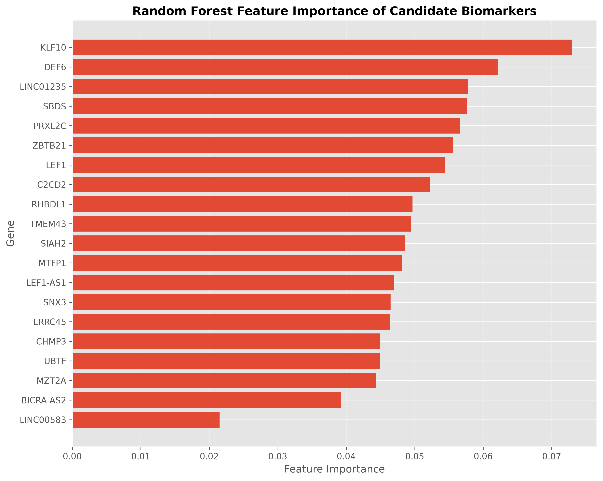
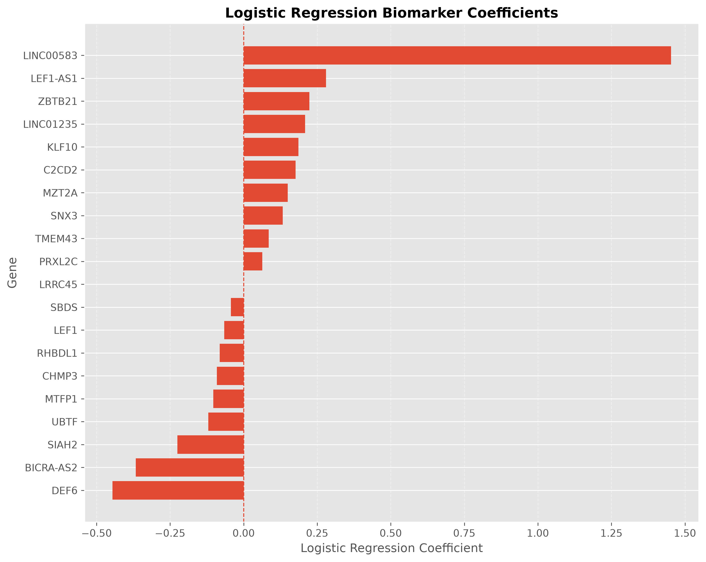
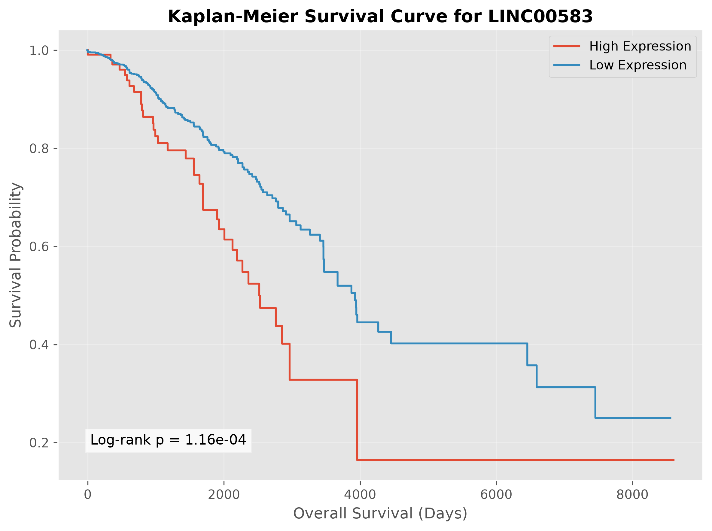
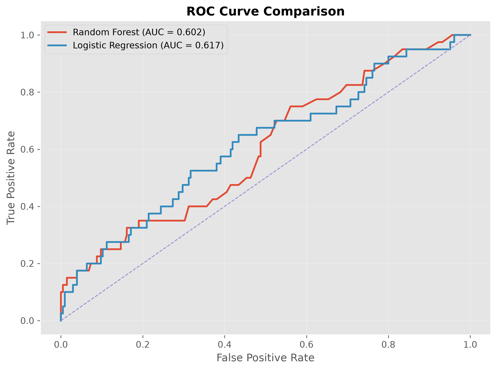
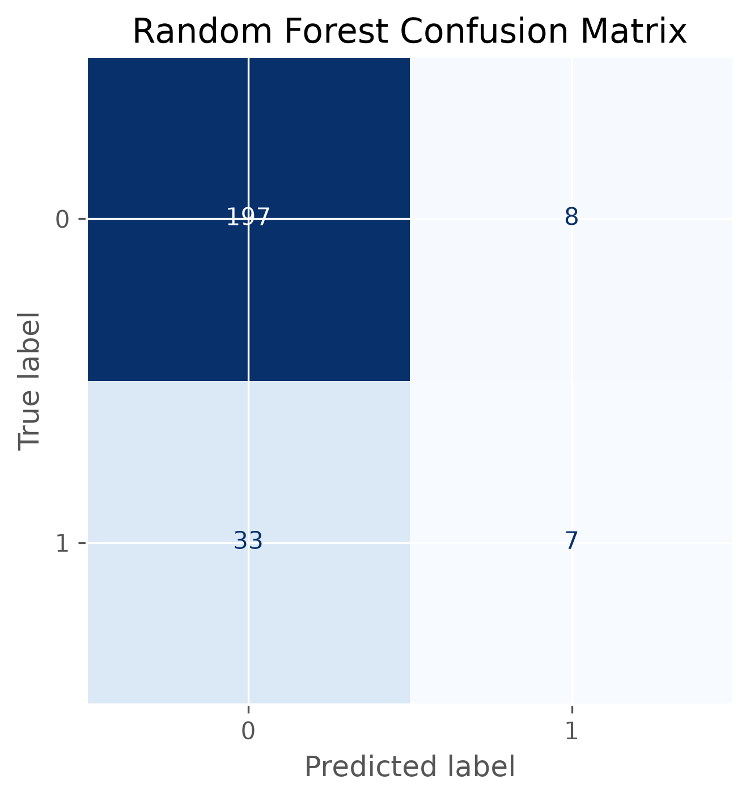
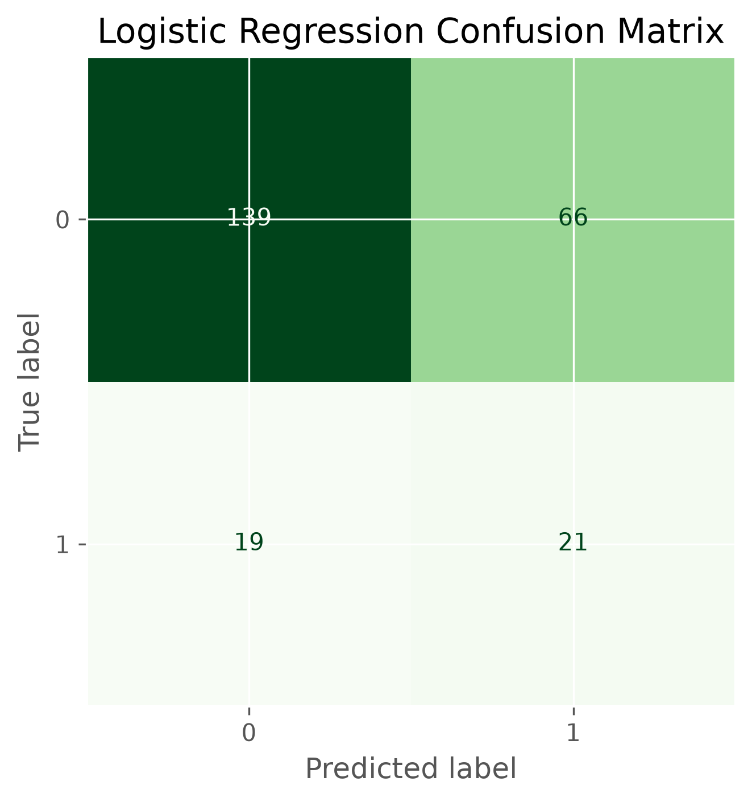

# TCGA Breast Cancer Biomarker Discovery Using Machine Learning and Survival Analysis

A bioinformatics project that identifies potential prognostic biomarkers for breast cancer using **TCGA-BRCA RNA-sequencing data**, machine learning, and survival analysis.

---

## Project Overview

Breast cancer is one of the most common cancers worldwide, and identifying biomarkers associated with patient survival can improve prognosis and personalized treatment strategies.

In this project, RNA sequencing data and clinical information from **The Cancer Genome Atlas (TCGA)** were analyzed to identify candidate prognostic biomarkers. Differential expression analysis, machine learning models, and survival analysis were integrated into a reproducible bioinformatics workflow.

---

## Objectives

- Process and clean TCGA-BRCA RNA-seq data
- Integrate clinical and gene expression datasets
- Identify candidate biomarker genes
- Predict patient survival using machine learning
- Validate biomarkers using survival analysis
- Develop a reproducible bioinformatics pipeline

---

## Dataset

**Source:** The Cancer Genome Atlas (TCGA)

**Cancer Type:** Breast Invasive Carcinoma (BRCA)

### Data Used

- RNA-seq gene expression (FPKM)
- Clinical patient information

---

## Workflow

```text
TCGA RNA-seq Data
        │
        ▼
Data Cleaning & Preprocessing
        │
        ▼
Clinical Data Integration
        │
        ▼
Differential Expression Analysis
        │
        ▼
Top Candidate Biomarkers
        │
        ├──────────────┐
        ▼              ▼
Random Forest    Logistic Regression
        │              │
        └──────┬───────┘
               ▼
Kaplan-Meier Survival Analysis
               │
               ▼
Cox Proportional Hazards Model
               │
               ▼
Candidate Prognostic Biomarker
```

---

## Repository Structure

```text
tcga-biomarker-discovery/
│
├── data/
│   ├── raw/
│   └── processed/
│
├── images/
│
├── notebooks/
│   └── biomarker_analysis.ipynb
│
├── results/
│
├── src/
│
├── requirements.txt
└── README.md
```

---

## Methods

### Data Preprocessing

- Loaded TCGA BRCA RNA-seq expression data
- Loaded and cleaned clinical metadata
- Removed duplicate genes
- Matched patient IDs across datasets
- Prepared expression matrix for analysis

### Differential Expression Analysis

- Statistical comparison of gene expression
- Candidate biomarker selection
- Multiple-testing correction

### Machine Learning

Two classification models were trained:

- Random Forest
- Logistic Regression

Performance was evaluated using:

- Accuracy
- Precision
- Recall
- F1-score
- ROC-AUC
- Confusion Matrices

### Survival Analysis

Candidate biomarkers were validated using:

- Kaplan-Meier Survival Curves
- Log-rank Test
- Cox Proportional Hazards Regression

---

# Results

## Machine Learning Performance

| Model | Accuracy | Precision | Recall | ROC-AUC |
|--------|---------:|----------:|-------:|--------:|
| Random Forest | 0.833 | 0.467 | 0.175 | 0.602 |
| Logistic Regression | 0.653 | 0.241 | 0.525 | 0.617 |

The Random Forest classifier achieved higher overall accuracy, while Logistic Regression demonstrated improved recall for identifying patients with poor survival outcomes.

---

## Key Findings

- Twenty candidate biomarker genes were identified.
- Random Forest ranked **KLF10**, **DEF6**, and **LINC01235** among the most influential predictive genes.
- Survival analysis identified **LINC00583** as a significant prognostic biomarker.
- Kaplan-Meier analysis demonstrated a significant survival difference between high and low LINC00583 expression groups.
- Cox proportional hazards regression estimated a hazard ratio of **6.34**, indicating that increased LINC00583 expression was associated with poorer survival.

---

# Figures

## Random Forest Feature Importance



---

## Logistic Regression Coefficients



---

## Kaplan-Meier Survival Curve



---

## ROC Curve Comparison



---

## Random Forest Confusion Matrix



---

## Logistic Regression Confusion Matrix



---

# Technologies Used

- Python
- Pandas
- NumPy
- Matplotlib
- Scikit-learn
- Lifelines
- Jupyter Notebook
- Git
- GitHub

---

# Future Improvements

- Validate findings using independent breast cancer datasets.
- Incorporate additional clinical variables such as age, tumor stage, and molecular subtype.
- Evaluate additional machine learning models (e.g., XGBoost).
- Develop a multi-gene prognostic risk score.

---

# References

- The Cancer Genome Atlas (TCGA)
- Scikit-learn Documentation
- Lifelines Documentation

---

# Author
**Pal Gaurav Rabheru**

Biotechnology Student, University of Houston

GitHub: https://github.com/palrabheru